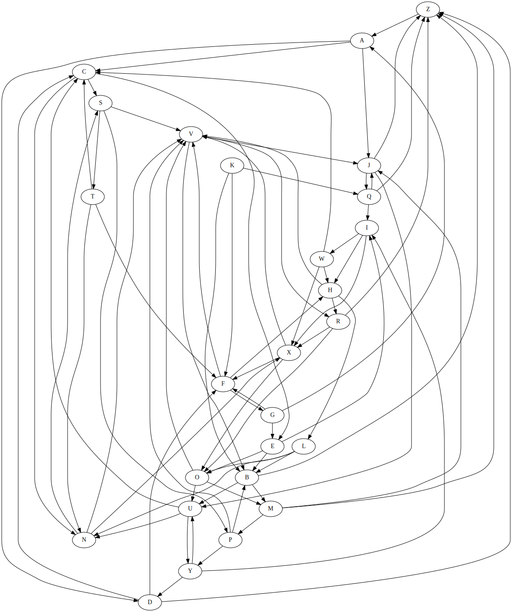

# StateMachineAssessment

## Purpose

The server is intended to provide a simulation of a state machine structure.  This is implemented using a graph structure that has the nodes to represent states and each edge to represent the transition from one state to another.

## Features

1. Allows users to pick a path from 1-3 from each path.
2. Visualization provided to help follow along with the machine once it has started.
3. Feedback of each state transition provided in the from of logs.

## Backlog

1. Visualization could update the path followed to show up in a different color. This would make clear which path has been chosen.
2. Could expand capabilities to allow for more paths instead of 3.
3. Could insure path 'A' to 'Z' is possible before http request.

## Installation

1. Clone the repo and cd:
```bash
git clone git@github.com:seanmull/StateMachineAssessment.git
cd state_machine_structure
```
2. Start up virtual environment with python3.10:
```bash
virtualenv venv --python=python3.10
source venv/bin/activate
```
3. Install dependencies:
```bash
python3.10 -m pip install flask
```
4. Run application in one terminal to start up the server:
```bash
python3.10 app.py
```
5. In another terminal run the following to trigger GET request:
```bash
curl http://localhost:65432/path/{1..3}
```
## Anticipated behavior

The server logs should display the before and after states, after the GET request.  
In addition, when the server starts up an svg file should be present in the visualization folder.

